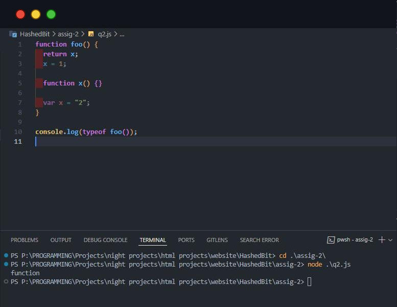

### :rocket: Assignment-2

<b>1. What is the output of this snippet of code?<b>

```javascript
function foo() {
  x = 1;
  function x() {}
  var x = "2";
  return x;
}
alert(typeof foo());
```

#### _Output_


<b>2. What is the output of this snippet of code?<b>

```javascript
function foo() {
  return x;
  x = 1;

  function x() {}

  var x = "2";
}
console.log(typeof foo());
```

#### _Output_



<b>3. What is the output of this snippet of code?<b>

```javascript
var x = 1;
function foo() {
  x = 10;
  return;
  function x() {}
}
foo();
console.log(x);
```

#### _Output_


